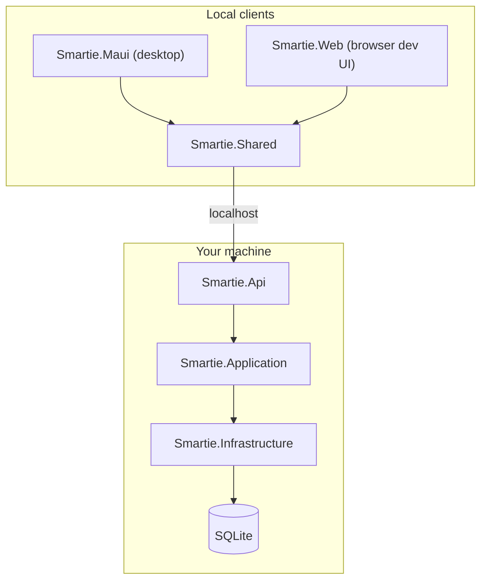

# Smartie — Community Edition v0.9 RC

**Smartie** is an AI-powered productivity operating system — desktop-first, local-first, and **bring-your-own-AI**. Community Edition is free, requires no login, keeps all your data on your machine, and ships with **no telemetry**.

> **Edition:** Community Edition · **Version:** 0.9.0 RC · **Platform:** Windows 10/11 desktop (x64)

---

## Download & install (recommended)

**Portable ZIP** is the recommended way to try Smartie — no installer, no certificate, works on any Windows PC.

### Requirements

| | |
|---|---|
| **OS** | Windows 10 (1809+) or Windows 11, **64-bit** |
| **Runtime** | WebView2 (preinstalled on Windows 11; [install manually](https://developer.microsoft.com/microsoft-edge/webview2/) on older systems if the app fails to open) |
| **AI** | Your own API key (Gemini, OpenAI, or OpenRouter) **or** [Ollama](https://ollama.com) for local models |

### Steps

1. Download **`Smartie-0.9.0-portable.zip`** from [GitHub Releases](https://github.com/smartie-ai/smartie/releases)
2. Extract to any folder (e.g. `C:\Apps\Smartie`)
3. Run **`Smartie.exe`**
4. If **Windows SmartScreen** appears: click **More info** → **Run anyway** (normal for unsigned indie apps)
5. Complete the welcome wizard and add your AI provider under **Settings → AI Providers**

### Uninstall

- Delete the folder where you extracted Smartie
- Optionally delete **`%LOCALAPPDATA%\Smartie`** to remove all local data (database, Knowledge Base files, settings)

### MSIX installer

Unsigned MSIX packages **cannot** be installed by most users (certificate error `0x800B010A`). MSIX is for **signed** builds or developer sideloading only. See [docs/Packaging.md](docs/Packaging.md).

For public trials, use the **portable ZIP** above.

---

## Features

| Area | Highlights |
|------|------------|
| **Chat** | Streaming responses, Markdown, attachments, RAG citations, conversation history |
| **Knowledge Base** | Upload PDF/DOCX/MD, extract → chunk → embed, semantic search |
| **Memory** | Persistent facts injected into prompts |
| **Tasks** | Local task management with priorities and due dates |
| **Files** | Recent files, favorite folders, desktop integration |
| **Plugins** | Local plugin folder, example plugin included |
| **Automations** | Scheduled and event-driven local workflows |
| **Appearance** | Themes, accent colors, density — instant preview |
| **Command palette** | Quick navigation and actions |

---

## Architecture

Smartie uses **Clean Architecture** with a local ASP.NET Core backend and Blazor clients:



| Project | Role |
|---------|------|
| `Smartie.Maui` | **Primary** Windows desktop host (embeds API) |
| `Smartie.Web` | Browser dev UI |
| `Smartie.Api` | Local HTTP API |
| `Smartie.Application` | Business logic |
| `Smartie.Infrastructure` | SQLite, encryption, AI connectors |
| `Smartie.Shared` | Blazor UI |

---

## AI providers

| Provider | API key | Notes |
|----------|---------|-------|
| **Google Gemini** | Required | Default `gemini-2.5-flash` |
| **OpenAI** | Required | |
| **OpenRouter** | Required | OpenAI-compatible API |
| **Ollama** | Not required | Local models |

Configure in **Settings → AI Providers**. Keys are encrypted with Windows DPAPI and stored in local SQLite.

---

## Community Edition limitations

- No login, accounts, or cloud sync
- No hosted AI — you bring your own keys (except Ollama)
- No telemetry or usage tracking
- Windows desktop only for the MAUI host (Web UI for development)
- Plugins are local folder only — no marketplace

**Future:** Smartie Cloud (separate edition) — sign-in, sync, managed AI. See [ROADMAP.md](ROADMAP.md).

---

## Local data

All data under **`%LOCALAPPDATA%\Smartie`**:

```
Smartie/
├── smartie.db
├── KnowledgeBase/
├── ChatAttachments/
├── Memory/
├── Tasks/
├── Plugins/
├── Logs/
└── Cache/
```

Never commit these paths — see `.gitignore`.

---

## Build from source

### Prerequisites

- [.NET 9 SDK](https://dotnet.microsoft.com/download)
- MAUI workload: `dotnet workload install maui` (admin PowerShell, once)
- WebView2 Runtime (for running the app)

### Run in Visual Studio

1. Open `Smartie.sln`
2. Set startup project to **`Smartie.Maui`**
3. Configuration: **Debug** · Platform: **x64** (or Any CPU — repo syncs native WebView2 assets on build)
4. Press **F5**

If the window is blank on first run, **Rebuild Solution** and try again.

### Run from CLI

```powershell
dotnet run --project src/Smartie.Maui -f net9.0-windows10.0.19041.0
```

### Browser dev UI (optional)

```powershell
dotnet run --project src/Smartie.Api
dotnet run --project src/Smartie.Web
```

### Tests

```powershell
dotnet test
```

---

## Build a release package (maintainers)

### Portable ZIP (GitHub Releases)

**Script (recommended):**

```powershell
.\scripts\publish-portable.ps1 -Version 0.9.0
```

Output: `dist\Smartie-0.9.0-portable.zip`

**Visual Studio:**

1. Right-click **Smartie.Maui** → **Publish**
2. Profile: **`win-x64-portable`**
3. Target: `dist\Smartie-0.9.0-portable\publish\`
4. Configuration: **Release** · Platform: **x64**
5. Click **Publish**, then zip the **contents** of the `publish` folder as `Smartie-0.9.0-portable.zip`

Full guide: **[docs/Installation-Package-Generation.md](docs/Installation-Package-Generation.md)**

### MSIX (signed distribution only)

```powershell
.\scripts\publish-msix.ps1 -Version 0.9.0 -Sign -CertificatePath "cert.pfx" -CertificatePassword "password"
```

Details: **[docs/Packaging.md](docs/Packaging.md)**

---

## Documentation

| Doc | Purpose |
|-----|---------|
| [docs/Installation-Package-Generation.md](docs/Installation-Package-Generation.md) | Step-by-step portable + MSIX build |
| [docs/Packaging.md](docs/Packaging.md) | Packaging reference, troubleshooting |
| [ROADMAP.md](ROADMAP.md) | Product roadmap |

---

## Roadmap

See [ROADMAP.md](ROADMAP.md). v0.9 RC focus: packaging, polish, GitHub release readiness.

- [x] Chat, Knowledge Base, RAG, Memory, Tasks, Files
- [x] Plugins, Automations, themes, onboarding
- [x] Portable + MSIX packaging scripts
- [ ] Smartie Cloud (future edition)

---

## Screenshots

Place release screenshots in [`screenshots/`](screenshots/) — see [`screenshots/README.md`](screenshots/README.md).

---

## License

MIT — see [LICENSE](LICENSE).
