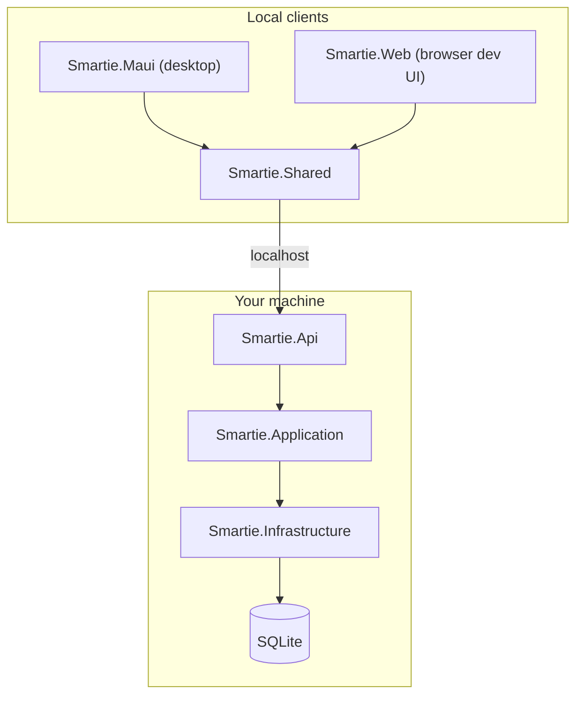

# Smartie — Community Edition v0.9 RC

**Smartie** is an AI-powered productivity operating system — desktop-first, local-first, and **bring-your-own-AI**. Community Edition is free, requires no login, keeps all your data on your machine, and ships with **no telemetry**.

> **Edition:** Community Edition · **Version:** 0.9.0 RC · **Platform:** Windows desktop (.NET MAUI)

---

## Features

| Area | Highlights |
|------|------------|
| **Chat** | Streaming responses, Markdown, attachments, RAG citations, conversation history |
| **Knowledge Base** | Upload PDF/DOCX/MD, extract → chunk → embed, semantic search |
| **Memory** | Persistent facts injected into prompts |
| **Tasks** | Local task management with priorities and due dates |
| **Files** | Recent files, favorite folders, desktop integration |
| **Plugins** | Local plugin folder, example plugin included |
| **Automations** | Scheduled and event-driven local workflows |
| **Appearance** | Themes, accent colors, density — instant preview |
| **Command palette** | Quick navigation and actions |

---

## Installation

### Portable (recommended for GitHub releases)

1. Download `Smartie-0.9.0-portable.zip` from [Releases](https://github.com/smartie-ai/smartie/releases)
2. Extract anywhere and run **Smartie.exe**
3. Complete the welcome wizard and add your AI provider in **Settings**

### MSIX

Install the `.msix` package (requires sideloading or a signed certificate). See [docs/Packaging.md](docs/Packaging.md).

### Build from source

```powershell
git clone https://github.com/smartie-ai/smartie.git
cd smartie
dotnet workload install maui   # once, admin required
.\scripts\publish-portable.ps1 -Version 0.9.0
# Run: dist\Smartie-0.9.0-portable\publish\Smartie.exe
```

---

## Architecture

Smartie uses **Clean Architecture** with a local ASP.NET Core backend and Blazor clients:



| Project | Role |
|---------|------|
| `Smartie.Maui` | **Primary** Windows desktop host (embeds API) |
| `Smartie.Web` | Browser dev UI |
| `Smartie.Api` | Local HTTP API |
| `Smartie.Application` | Business logic |
| `Smartie.Infrastructure` | SQLite, encryption, AI connectors |
| `Smartie.Shared` | Blazor UI |

Full packaging guide: **[docs/Packaging.md](docs/Packaging.md)** · Step-by-step install package build: **[docs/Installation-Package-Generation.md](docs/Installation-Package-Generation.md)**

---

## AI providers

| Provider | API key | Notes |
|----------|---------|-------|
| **Google Gemini** | Required | Default `gemini-2.5-flash` |
| **OpenAI** | Required | |
| **OpenRouter** | Required | OpenAI-compatible API |
| **Ollama** | Not required | Local models |

Configure in **Settings → AI Providers**. Keys are encrypted with Windows DPAPI and stored in local SQLite.

---

## Community Edition limitations

- No login, accounts, or cloud sync
- No hosted AI — you bring your own keys (except Ollama)
- No telemetry or usage tracking
- Windows desktop only for MAUI host (Web UI for development)
- Plugins are local folder only — no marketplace

**Future:** Smartie Cloud (separate edition) — sign-in, sync, managed AI. See [ROADMAP.md](ROADMAP.md).

---

## Local data

All data under **`%LOCALAPPDATA%\Smartie`**:

```
Smartie/
├── smartie.db
├── KnowledgeBase/
├── ChatAttachments/
├── Memory/
├── Tasks/
├── Plugins/
├── Logs/
└── Cache/
```

Never commit these paths — see `.gitignore`.

---

## Development

### Prerequisites

- .NET 9 SDK
- MAUI workload + WebView2

### Run desktop app

```bash
dotnet run --project src/Smartie.Maui -f net9.0-windows10.0.19041.0
```

### Run browser dev UI

```bash
dotnet run --project src/Smartie.Api
dotnet run --project src/Smartie.Web
```

### Tests

```bash
dotnet test
```

---

## Roadmap

See [ROADMAP.md](ROADMAP.md). v0.9 RC focus: packaging, polish, GitHub release readiness.

- [x] Chat, Knowledge Base, RAG, Memory, Tasks, Files
- [x] Plugins, Automations, themes, onboarding
- [x] Portable + MSIX packaging scripts
- [ ] Smartie Cloud (future edition)

---

## Screenshots

Place release screenshots in [`screenshots/`](screenshots/) — see [`screenshots/README.md`](screenshots/README.md).

---

## License

MIT — see [LICENSE](LICENSE).
