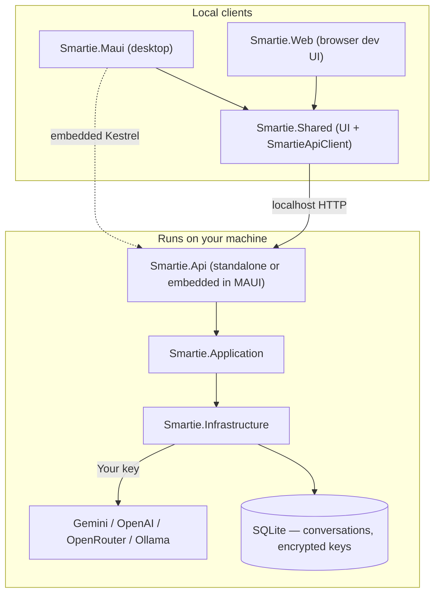

# Smartie — Community Edition

Smartie is an **AI-powered productivity operating system** — desktop-first, local-first, and **bring-your-own-AI**. Community Edition is free, requires no login, and keeps all your data on your machine.

> **Current focus:** Community Edition only. No auth, billing, cloud sync, or hosted AI. Smartie Cloud is planned for the future and is not implemented.

---

## Community Edition at a glance

| | |
| --- | --- |
| **Login** | None |
| **Subscription / billing** | None |
| **AI keys** | You provide your own (Gemini, OpenAI, OpenRouter, or Ollama) |
| **Key storage** | Encrypted locally (Windows DPAPI) in SQLite |
| **Data** | Conversations and settings stay on this device |
| **Offline AI** | Ollama (local models) |
| **Desktop** | `Smartie.Maui` (Windows native window) |
| **Dev UI** | `Smartie.Web` (same UI in a browser) |

---

## Architecture

Smartie uses **Clean Architecture** with a local ASP.NET Core backend and thin Blazor clients. The backend holds the database and encrypted keys; clients only speak DTOs over HTTP to `localhost`.



| Project | Role |
| --- | --- |
| `Smartie.Domain` | Entities (`User`, `Conversation`, `Message`, `AiProviderCredential`) |
| `Smartie.Application` | Ports and use cases; provider catalog; no provider hardcoding |
| `Smartie.Infrastructure` | EF Core + SQLite, DPAPI encryption, Semantic Kernel connectors |
| `Smartie.Api` | Local minimal API; seeds a single local profile (no auth) |
| `Smartie.Shared` | Shared Blazor UI (Chat, Settings, About) |
| `Smartie.Maui` | **Primary** desktop host (Windows) |
| `Smartie.Web` | Optional browser host for development |
| `Smartie.Contracts` | Shared DTOs |
| `Smartie.Tests` | Unit and integration tests |

The `User` entity and `ICurrentUser` abstraction remain in the schema so a future cloud edition can add real accounts without a rewrite — Community Edition simply uses one seeded local profile.

---

## Tech stack

- **.NET 9**, **C#**
- **SQLite** + **EF Core** (all data local)
- **Semantic Kernel** with pluggable providers (Gemini, OpenAI-compatible for OpenRouter/Ollama)
- **Windows DPAPI** for API key encryption at rest
- **Blazor** + **MAUI Blazor Hybrid** (desktop) + **Markdig**

---

## Getting started

### Prerequisites

- [.NET 9 SDK](https://dotnet.microsoft.com/download)
- An API key from your chosen provider **or** a local [Ollama](https://ollama.com) install
- For desktop: MAUI workload (`dotnet workload install maui`, admin required) + WebView2 (Windows 11)

### 1. Start the local backend (browser dev only)

For **Smartie.Web**, run the API first:

```bash
dotnet run --project src/Smartie.Api
```

Listens on `http://localhost:5220`, applies migrations, and creates `%LOCALAPPDATA%/Smartie/smartie.db`.

**Desktop (`Smartie.Maui`)** embeds this API automatically — skip this step unless you set `HostEmbedded: false`.

### 2. Start a client

**Desktop (recommended — API starts automatically):**

```bash
dotnet run --project src/Smartie.Maui -f net9.0-windows10.0.19041.0
```

MAUI hosts the local API in-process on `127.0.0.1` (default port `5220`, or the next free port). You do **not** need a separate `Smartie.Api` terminal for normal desktop use.

To use an external API instead (e.g. debugging the backend alone), set in `Smartie.Maui/appsettings.json`:

```json
"SmartieApi": { "HostEmbedded": false, "BaseUrl": "http://localhost:5220" }
```

Then run `Smartie.Api` separately.

**Browser (development):**

```bash
dotnet run --project src/Smartie.Api
dotnet run --project src/Smartie.Web
```

In Visual Studio: for **browser dev**, use multiple startup projects (`Smartie.Api` + `Smartie.Web`). For **desktop**, start **`Smartie.Maui` only**.

### 3. Configure your AI provider

Open **Settings** in the app:

1. Pick a provider (Gemini, OpenAI, OpenRouter, or Ollama)
2. Enter your API key and model (Ollama: endpoint + model only)
3. Click **Save**, then **Use this**

Chat will prompt you to complete setup if no key is configured.

### Run tests

```bash
dotnet test
```

---

## AI providers

| Provider | API key | Default model | Notes |
| --- | --- | --- | --- |
| **Google Gemini** | Required | `gemini-2.5-flash` | |
| **OpenAI** | Required | `gpt-4o-mini` | |
| **OpenRouter** | Required | `openai/gpt-4o-mini` | Uses `https://openrouter.ai/api/v1` |
| **Ollama** | Not required | `llama3.1` | Local; default endpoint `http://localhost:11434/v1` |
| **Smartie Cloud** | — | — | Coming soon; disabled in Community Edition |

Keys are **never returned** to the client after save. Provider selection is resolved **per request** from your local settings.

---

## API surface (local)

| Method | Route | Purpose |
| --- | --- | --- |
| `GET` | `/health` | Liveness |
| `GET/POST/DELETE` | `/api/conversations` | Conversation list, create, delete |
| `PUT` | `/api/conversations/{id}/pin` | Pin or unpin a conversation |
| `GET/POST` | `/api/conversations/{id}/messages` | Messages (+ SSE stream) |
| `POST` | `/api/conversations/{id}/messages/{messageId}/edit/stream` | Edit user message and regenerate (SSE) |
| `GET` | `/api/settings/ai` | Provider settings (no keys) |
| `PUT` | `/api/settings/ai/provider` | Select active provider |
| `PUT` | `/api/settings/ai/providers/{provider}` | Save key/model/endpoint |

---

## Configuration

**Backend (`src/Smartie.Api/appsettings.json`)**

| Key | Purpose |
| --- | --- |
| `Ai:SystemPrompt` | System prompt for all chats |
| `ConnectionStrings:Smartie` | SQLite path (empty = `%LOCALAPPDATA%/Smartie/smartie.db`) |

Community Edition does **not** use a server-side API key. Configure providers in the app **Settings** page.

**Clients**

| Host | API |
| --- | --- |
| `Smartie.Maui` | Embedded on `127.0.0.1` by default (`SmartieApi:Port`, fallback to dynamic port) |
| `Smartie.Web` | External — `SmartieApi:BaseUrl` in `Smartie.Web/appsettings.json` (default `http://localhost:5220`) |

Set `SmartieApi:HostEmbedded` to `false` in MAUI to point at an external API instead.

---

## Roadmap (Community Edition)

- [x] Chat with streaming, Markdown, persistence
- [x] Conversation list, pin, delete, stop generation
- [x] Edit user messages (truncate and regenerate)
- [x] Multi-provider BYOK (Gemini / OpenAI / OpenRouter / Ollama)
- [x] Encrypted local key storage + Settings page
- [x] Desktop host (MAUI, Windows)
- [ ] Memory, Knowledge Base, Tasks, Files, Automations, Dashboard
- [ ] Agent tools (e.g. open app/website with confirmation)

**Not in scope for Community Edition:** authentication, Stripe, cloud sync, hosted AI, usage limits.

**Future (separate edition):** Smartie Cloud — sign-in, sync, managed AI. Architecture is kept open via provider abstraction and the `User` schema; no cloud code ships today.
